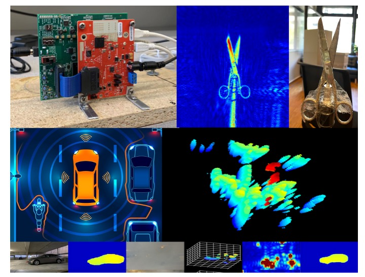

# COM-304: Communication Project. mmWave Radars

This repository contains the material for the mmWave radar project of the course COM-304 at EPFL. We have prepared tutorial and videos on background information listed below. We recommend going through the videos in order.

# Study Material: Background Lectures and Reading Material

We also have videos on relevant background material in wireless sensing and imaging. Go through these videos to get a basic understanding. The radar signal processing videos will contain extremely important information regarding how you will implement your homeworks. Algorithms 1 & 3 correspond to beamforming and matched filter which are the heart of the homeworks. 

- [Wireless Channel](https://drive.google.com/file/d/1U9uZPo3BGUd1OmABDrBEvJCC7zzfRUcX/view?usp=sharing)
- [Radar Signal Processing Part 1](https://drive.google.com/file/d/1yGauDMUWJAcJZ8CXglKKwFKr1sgutI52/view?usp=drive_link)
- [Radar Signal Processing Part 2](https://drive.google.com/file/d/1px1rs0pZC4aFFp012tHNV9iMDyW1iZEy/view?usp=drive_link)

If you are interested in more information on wireless networks, check out the videos references in the [Wireless Communications Project GitHub](https://github.com/samhy99/COM-304-BladeRF).

Advanced Topics:
- [Kalman Filters](https://drive.google.com/file/d/1_w2JmI44n0ccYkC14DZS7LDYJYYkVMf1/view?usp=drive_link)
- [Hidden Markov Models & Particle Filters](https://drive.google.com/file/d/1IkyOEt_X85PvOVKjdYTHT18G8vaQOyIa/view?usp=drive_link)

# Study Material: Tutorials
TI mmWave Radar Setup:
- [Getting started with TI Radars](Radar_setup.pdf): Document steps you through installation and set up for radars and this GitHub repo.
- [Recorded Tutorial](https://drive.google.com/file/d/1uaS0wtz7ObpLxDCFIc6ieWcw1DtBLeYQ/view?usp=sharing): Note that you still need to set up your computer as described in the Wiki before following this.

TI Provided Material:
- [TI FMCW Radar Tutorials](https://www.ti.com/video/series/mmwave-training-series.html)
- [TI Sensors Forum](https://e2e.ti.com/support/sensors-group/)
- [TI Chirp Paramter Understanding](https://www.ti.com/lit/an/swra553a/swra553a.pdf?ts=1684912880969&ref_url=https3A2F2Fwww.ti.com2Ftool2FMMWAVE-DFP)

# Homeworks
There will be two homeworks that will help and prepare you for the project:

- [HW 1: 1D Beamforming & Matched Filter](homework/homework_1.ipynb): Introduction to radar image processing: beamforming, matched filter, and synthetic aperture radar in one dimension. You can use the data in the link [here](https://drive.google.com/drive/folders/1nlwuhJWaXnyrXdVq2ced3E1wyYrFIIHH?usp=sharing). 
- [HW 2: 2D Algorithms](homework/homework_2.ipynb): Extend the two algorithms to 2D. 

# General Info
- **Platforms Storage:** For the mmWave radars, we give them to you for the duration of the project, so you can take them home. If you wish to store them at EPFL, you can book a locker avaliable for students [here](https://mycamipro.epfl.ch/client/lockerassign). 
